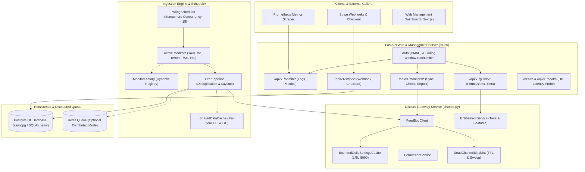
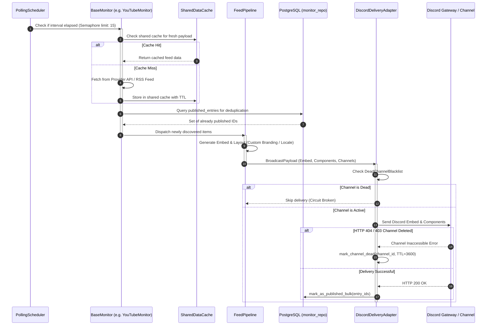
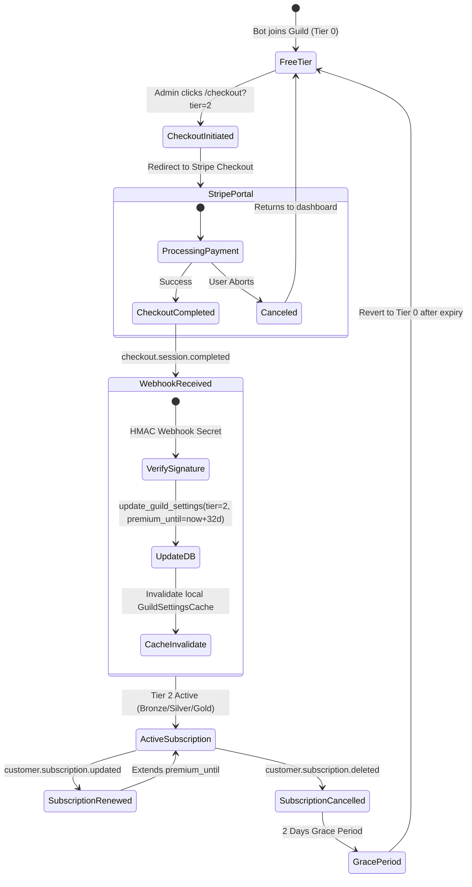
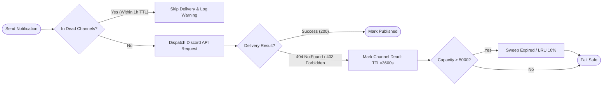

# Nova System Architecture & Design

This document details the high-level architecture, module interactions, and core data flows within the Nova Discord Feed Bot platform.

---

## 1. High-Level Component Architecture

Nova is organized as a decoupled, multi-layered system designed to support both single-process monolith execution and horizontally scalable distributed worker clusters.

---

## 2. Ingestion & Polling Pipeline Flow

---

## 3. Stripe Subscription & Entitlement Lifecycle

---

## 4. Dead-Channel Circuit Breaker Pattern

To prevent rate-limit starvation and excessive Discord API errors when servers delete channels without removing the bot's feeds, the delivery system utilizes an in-memory circuit breaker:

